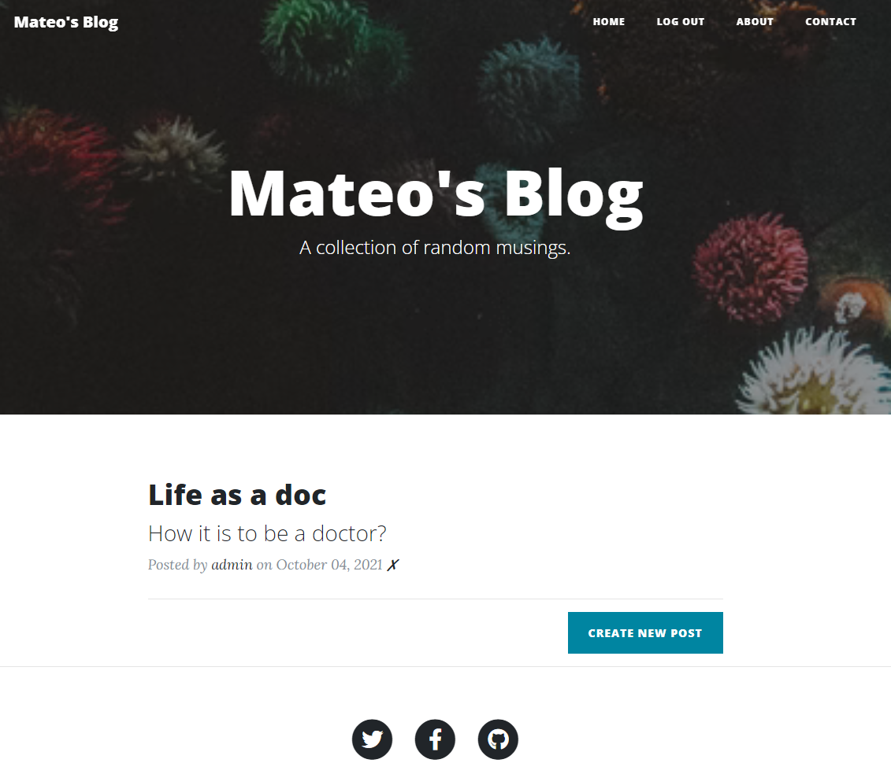
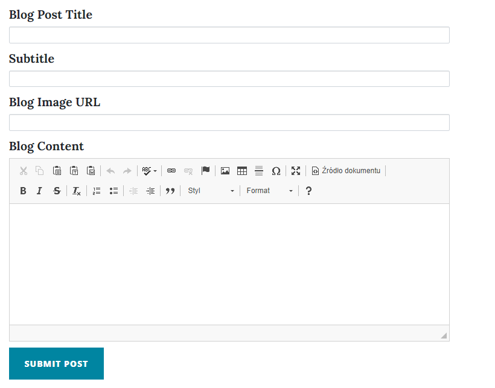
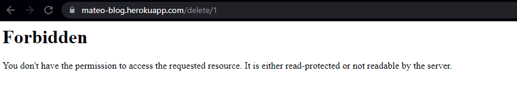

# blog-with-users
> Blog where someone can post thier musings, and others users can comment them.

## Table of contents
* [General info](#general-info)
* [Screenshots](#screenshots)
* [Technologies](#technologies)
* [Setup](#setup)
* [Status](#status)

## General info
This is my Flask capstone project. It contains RESTful routing, relational databases, authentication with hashed and salted passwords.
Frontend was made using bootstrap. 

Blog contains 3 relational databases: users, posts and comments.
First user with his ID = 1, gets admin privileges. It means that, he can add, edit and delete posts.
Other users can only read posts and comment them.

Post and comments can be written using ckeditor.

Initially SQLite was used for the project but it is a file-based database.
Unfortunately deploy on Heroku requires changing the database to postgreSQL. You can read more about it <a href="https://devcenter.heroku.com/articles/sqlite3">here</a>.

Blog is deployed on Heroku: <a href="https://mateo-blog.herokuapp.com/">Click!</a>

Main goal of the project was to systematise knowledge about the flask, and to deploy my first app.

## Demo

## To do
Additionaly functionality can be added so that the buttons at the bottom of the page take the user to the desired location instead of the contract page.

## Technologies
All technologies are listed in "requirements.txt" file, below are only few of them
* Python 3.8
* Flask 1.1.2
* SQLAlchemy 1.3.19

## Setup
Install missing libraries if necessary.
Add postgreSQL as an addon to Heroku, copy/paste the value of the DATABASE_URL variable, but change 'posgres://' to 'postgresql://'.

## Status
Project is: _deployed_.
